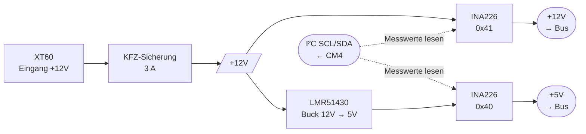

# Power PCB

<table>
  <tr><th>Top</th><th>Bottom</th></tr>
  <tr>
    <td></td>
    <td></td>
  </tr>
</table>

## Übersicht

Das Power-Modul ist die Schnittstelle zwischen externer Stromversorgung und dem [Bus](../HW-Module-BusBoard/). Es nimmt +12V über eine XT60-Buchse an, sichert den Eingang mit einer KFZ-Sicherung und stellt am Bus-Stecker **+12V (durchgereicht)** und **+5V (per Buck-Converter erzeugt)** zur Verfügung. Beide Rails werden je von einem INA226 gemessen — Spannung und Strom sind vom [CM4 Carrier](../HW-Module-CM4Carrier/) per I²C abrufbar.

## Block-Diagramm

## Versorgung

| Rail | Quelle | Bereich | Max. Strom | Bemerkung |
| ---- | ------ | ------- | ---------- | --------- |
| +12V Eingang | XT60-Buchse | 11.8 – 14.6 V | begrenzt durch 3 A KFZ-Sicherung | passend für 4S LiFePO4 / 12 V Bleiakku |
| +12V Bus | durchgeschleift vom Eingang | = Eingangsspannung | wie Sicherung (3 A) | direkt abhängig vom Eingang |
| +5V Bus | LMR51430 Buck-Converter | 5.0 V geregelt | 3 A typ. (LMR51430-Limit) | stabilisiert |

## Messung (I²C)

Beide Rails sind über je einen [INA226](https://www.ti.com/product/INA226) am I²C-Bus messbar:

| Rail | I²C-Adresse | Shunt | Strom-Vollausschlag | Strom-Auflösung |
| ---- | ----------- | ----- | ------------------- | --------------- |
| +12V | `0x41` (`0b1000001`) | 10 mΩ | ≈ 8.19 A (Vshunt,max = 81.92 mV) | 125 µA / LSB |
| +5V  | `0x40` (`0b1000000`) | 10 mΩ | ≈ 8.19 A | 125 µA / LSB |

Der INA226 liefert pro Adresse Bus-Spannung (in 1.25 mV-Schritten), Shunt-Spannung und einen integrierten Strom-Wert. Konfigurations- und Lese-Beispiele siehe INA226-Datenblatt.

## Bus-Stecker

20-poliger Conn_02x10. Dieses Modul **stellt** Strom-/Spannungs-Versorgung **bereit** und liest am I²C nur die eigenen INA226 — die vollständige Pinbelegung des Bus-Steckers (welche Pins +12V/+5V/GND/I²C/USB/etc. führen) ist auf dem [BusBoard](../HW-Module-BusBoard/) dokumentiert.

## Bestückung

- **KFZ-Sicherung 3 A** wird **separat aufgesteckt**, nicht von JLCPCB bestückt.
- **XT60-Polung:** Standard-Pinbelegung. XT60-Buchsen haben keine konzentrische Innen-/Außen-Polung wie ein Hohlstecker — nur zwei nebeneinanderliegende Kontakte; das passende Gegenstück bestimmt die Zuordnung.
- Hand-Löt-Schritte oder besondere Hinweise außerhalb des JLCPCB-Workflows: aktuell keine bekannt.

## Bringup

Nach Bestückung und Einsetzen der Sicherung:

1. **Idle-Test ohne Module:** +12V (z.B. 12 V Labornetzgerät, strombegrenzt auf 100 mA) an XT60 anlegen. Strom < 30 mA erwartet (nur INA226 + Buck-Quiescent).
2. **+5V Messung:** Am Bus-Stecker zwischen +5V-Pin und GND messen → 5.00 ± 0.05 V.
3. **+12V durchgereicht:** Am Bus-Stecker zwischen +12V-Pin und GND messen → entspricht Eingangsspannung minus Sicherungs-/Leitungs-Drop.
4. **I²C-Sanity:** Vom CM4 (oder per externem I²C-Adapter) ein `i2cdetect` auf dem Bus laufen lassen — Adressen `0x40` und `0x41` müssen ACK geben.

## Verwandte Module

- [Bus](../HW-Module-BusBoard/) — wird vom Power-Modul mit +5V/+12V versorgt und führt I²C zum CM4 weiter.
- [CM4 Carrier](../HW-Module-CM4Carrier/) — liest die INA226-Messwerte über I²C aus.

## Daten

- [Schaltplan]({{ site.data.project.name }}-schematic.pdf)
- [BOM]({{ site.data.project.name }}-bom.html)
- [iBOM]({{ site.data.project.name }}-ibom.html)
- [JLCPCB fabrication & stencil](JLCPCB/{{ site.data.project.name }}-_JLCPCB_compress.zip)
- [JLCPCB Bom](JLCPCB/{{ site.data.project.name }}_bom_jlc.csv)
- [JLCPCB Pick&Place](JLCPCB/{{ site.data.project.name }}_cpl_jlc.csv)
